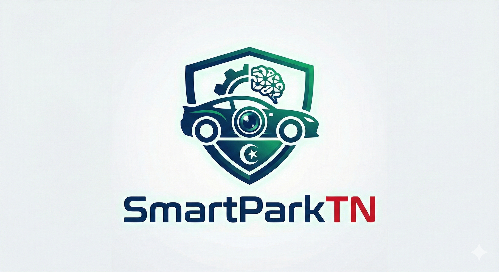

<h1 align="center">
  <br>
  🚗 SmartPark Tunisie
  <br>
  <br>
</h1>
<p align="center">
  
</p>
<h4 align="center">Système Intelligent de Gestion de Parking : ALPR (Reconnaissance de Plaques) + Assistant Métier IA (RAG)</h4>

<p align="center">
  <a href="#problématique">Problématique</a> •
  <a href="#notre-solution">Notre Solution</a> •
  <a href="#fonctionnalités-clés">Fonctionnalités Clés</a> •
  <a href="#architecture-technique">Architecture Technique</a> •
  <a href="#lancer-le-projet">Lancer le projet</a>
</p>

---

## 🛑 Problématique

Aujourd'hui, les parkings modernes (centres commerciaux, entreprises, hôpitaux, zones industrielles) font face à un flux massif et constant de véhicules. 

Les gestions manuelles traditionnelles ou par simple distribution de tickets posent de graves problèmes :
- **Lenteur d'exécution** générant des bouchons aux barrières.
- **Erreurs humaines** lors de la vérification de l'identité des abonnés ou des VIP.
- **Litiges fréquents** (tickets perdus, heures d'entrée contestées, dépassements non justifiables).
- **Incapacité** à appliquer dynamiquement des politiques tarifaires complexes ou des restrictions horaires.

## 💡 Notre Solution : SmartPark Tunisie

**SmartPark Tunisie** résout cette impasse grâce à l'Intelligence Artificielle. Le projet remplace le contrôle biométrique humain et les systèmes de bornes lents par un œil informatique infaillible.

En scannant *directement le flux vidéo* des caméras à l'entrée et à la sortie, notre système capture, redresse, nettoie et lit automatiquement les plaques d'immatriculation tunisiennes (ALPR). Un moteur de règles croise ensuite instantanément ces données pour accorder (ou refuser) l'accès, ouvrir la barrière et commencer la facturation, le tout en une fraction de seconde. 

**Le *"Plus"* Technologique :** Au-delà de la simple détection, le système embarque un *Assistant IA RAG (Retrieval-Augmented Generation)* exclusif, capable de comprendre tous les textes réglementaires du parking et d'aiguiller le personnel de surveillance en langage naturel.

## ✨ Fonctionnalités Clés

* **📸 Détection ALPR Tunisienne Haute-Fidélité :**
  * Traitement OCR ultra-robuste adapté au format `XXX تونـس XXXX`.
  * Filtres correctifs dynamiques : Lisibilité conservée de nuit (CLAHE), sous la pluie (Denoising), en mouvement (Sharpening) ou de biais (Correction d'angle).
  * Prise en charge des **images et des scans flux vidéos dynamiques (.mp4, .avi)**.
## 📸 Application Preview

<p align="center">
  
</p>

* **🧠 Moteur de Décision & Catégorisation Multi-Niveaux :**
  * Attribution instantanée de profils complexes : **VIP, Abonnés, Liste Noire, Visiteurs**.
  * Détection intelligente du profil du véhicule : **Berline, SUV, Moto, Camion**.
  * Autorisations conditionnelles (ex: accès refusé en dehors des horaires de travail).

* **📊 Traçabilité & Monétisation Instantanée:**
  * Enregistrement en base de données immuable (Heure d'entrée exacte).
  * Facturation automatisée à la seconde près lors de la sortie, calcul du prorata et application de multiplicateurs tarifaires selon le profil.

* **🤖 Chatbot IA "Métier" Intégré:**
  * Assistant flottant ultra-moderne conçu en *Glassmorphism*.
  * L'IA analyse les PDF et documents d'entreprise liés pour répondre aux vigiles ou administrateurs (ex: *"Quel est le tarif au delà de 10 minutes ?"* ou *"Pourquoi la plaque XXXX a-t-elle été rejetée ?"*).

## 🧰 Architecture Technique

Ce projet est pensé pour être modulaire, rapide et local (Privacy-First) :

- **Frontend & Dashboard :** Streamlit (Python) avec injection CSS personnalisée. Interface réactive et composants asynchrones.
- **Computer Vision :** OpenCV (Traitement de l'image & extraction de frames vidéos), Pillow.
- **Moteur OCR (Lecture de caractères) :** Modèles d'IA Heuristiques & Machine Learning optimisés pour scènes dégradées.
- **Base de Données / Historique :** SQLite embarqué (`storage.py`) pour garantir zéro fuite de données d'immatriculation vers le cloud.
- **RAG & Chatbot :** LangChain, modèles LLMs locaux (Ollama/Mistral) pour la compréhension documentaire.

## 🚀 Lancer le projet (Pour le Jury)

Si vous disposez de l'environnement configuré, le lancement est immédiat via le terminal :

```bash
# 1. Obtenir l'environnement virtuel et installer les dépendances nécessaires (dont OpenCV)
python -m venv .venv

# 2. Lancer l'interface SmartPark
streamlit run app.py
```

*Le tableau de bord s'ouvrira automatiquement à l'adresse `http://localhost:8501`. Préparez quelques fausses plaques et de petites séquences vidéos pour apprécier la démonstration !*
